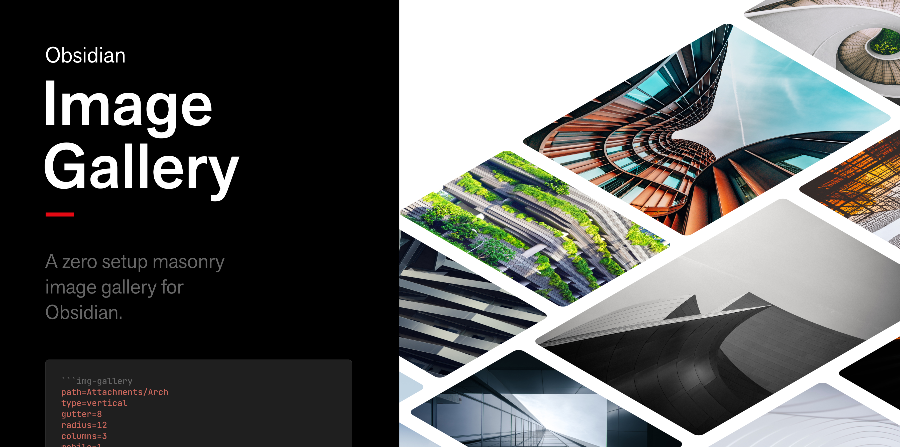
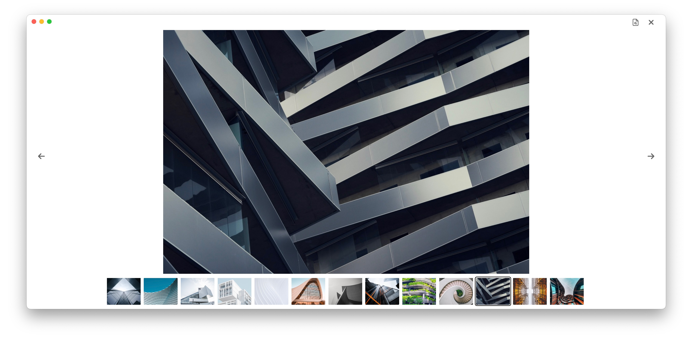
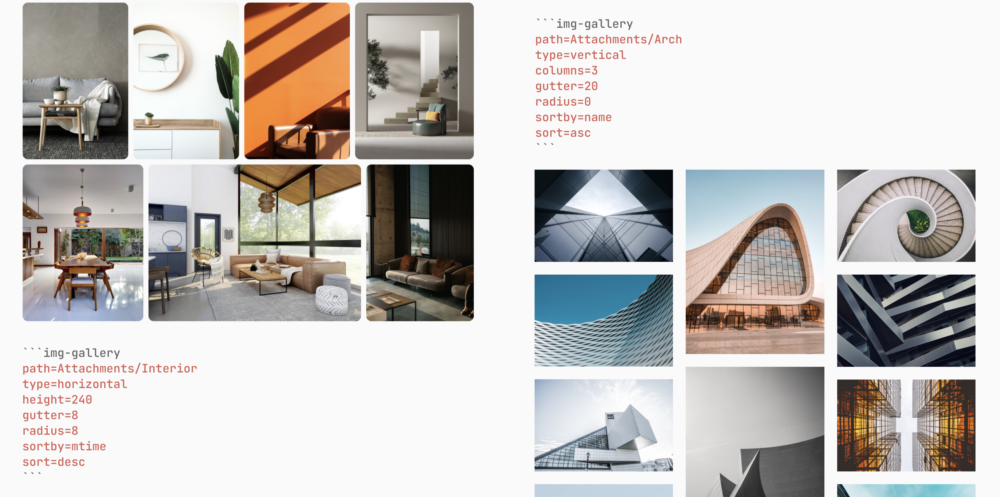

# Obsidian Image Gallery
Obsidian Image Gallery is a zero setup masonry image gallery for [Obsidian](https://obsidian.md/).

**Table of Contents**
- [Requirements](#requirements)
- [Usage](#usage)
- [Settings](#settings)
- [Notes](#notes)
- [Examples](#examples)
- [Acknowledgments](#acknowledgments)
- [License](#license)
- [Contacts](#contacts)

## Requirements

- [Obsidian](https://obsidian.md/) `(ver >= 1.1.8)`
- A folder(s) of local images located somewhere in your vault

## Installation

Obsidian Image Gallery can be installed from within Obsidian, as for [every other community plugin](https://help.obsidian.md/Advanced+topics/Community+plugins#Discover+and+install+community+plugins).

## Usage

To create a dynamic gallery, add one of the following code blocks to a note (make sure to customize the path!):

For a horizontal masonry:
````
```img-gallery
path: Attachments/Folder
type: horizontal
```
````

For a vertical masonry:
````
```img-gallery
path: Attachments/Folder
type: vertical
```
````

Take a look at [settings](#settings) to see how to tweak some properties of the gallery; the examples available above are the most minimal configuration possible.

In *[Live Preview](https://help.obsidian.md/Live+preview+update)* mode, the gallery will be generated after moving the cursor outside the code block. Using the regular *Source Mode*, press `cmd+e` (or `ctrl+e`) to trigger Obsidian's Note Preview.


`1.1.1` introduces a lightbox view accessible by clicking on any image part of the gallery. Then, if you need to, click the button on the top right to open the original image in a new tab.



## Settings

Settings can be customized in any order, in `yaml` syntax. Optional properties default to the values outlined in the tables below:

| Option   | Default      | Alternatives    | Required | Description                            |
| -------- | ------------ | --------------- | -------- | -------------------------------------- |
| `path`   | -            | -               | Yes      | Path relative to the root of the vault |
| `type`   | `horizontal` | `vertical`      | No       | Type of masonry                        |
| `gutter` | `8`          | (any number)    | No       | Spacing in px between the images       |
| `radius` | `0`          | (any number)    | No       | Border radius in px of the images      |
| `sortby` | `ctime`      | `mtime`, `name` | No       | Sort images by                         |
| `sort`   | `desc`       | `asc`           | No       | Order of sorting                       |

Options applicable only for `type=horizontal`:

| Option   | Default | Alternatives | Required | Description              |
| -------- | ------- | ------------ | -------- | ------------------------ |
| `height` | `260`   | (any number) | No       | Height in px of all rows |

Options applicable only for `type=vertical`:

| Option    | Default | Alternatives | Required | Description                   |
| --------- | ------- | ------------ | -------- | ----------------------------- |
| `columns` | `3`     | (any number) | No       | Number of columns for desktop |
| `mobile`  | `1`     | (any number) | No       | Number of columns for mobile  |


## Notes:
- For `path` there is no need to specify the name of the vault
- As mentioned in the [Requirements](#requirements) section, only local images are accepted. This plugin was designed with a specific use case in mind: create a gallery from a folder of images with as little setup as possible.
- Make sure the images to embed have a reasonable size: generating a masonry with 60 4k photos will most likely slow down the app to a crawl!

An additional note about the orientation of the masonry vs. the distribution of its images: [until a true masonry layout](https://drafts.csswg.org/css-grid-3/) is available for native `css` grids, the sorting of the vertical version is a hit or miss. This is because the flow of its elements goes from top to bottom (see [this article](https://css-tricks.com/piecing-together-approaches-for-a-css-masonry-layout) for more info about it.) If sorting is critical, please rely on the horizontal version; its images are sometimes cropped, but their ordering is way more intuitive.

## Examples:


## Changelog

`1.1.1`
  - fixed bug for the "open image in new tab" feature

`1.1.0`
  - fixed alphabetical sorting
  - introduced lightbox for both desktop and mobile
  - added a "open image in new tab" button available in the lightbox
  - fixed the casing of README.md to let Obsidian retrieve the correct file

## Acknowledgments
All photos in the header are by various photographers and available on [Unsplash](https://unsplash.com/s/photos/architecture).

## License


## Contacts
- Twitter: [@lucaorio_](http://twitter.com/@lucaorio_)
- Website: [lucaorio.com](http://lucaorio.com)
- Email: [luca.o@me.com](mailto:luca.o@me.com)
